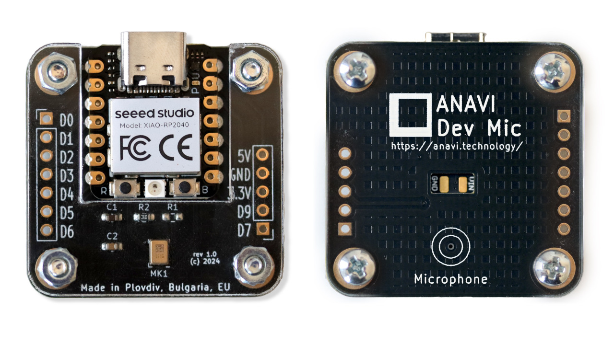
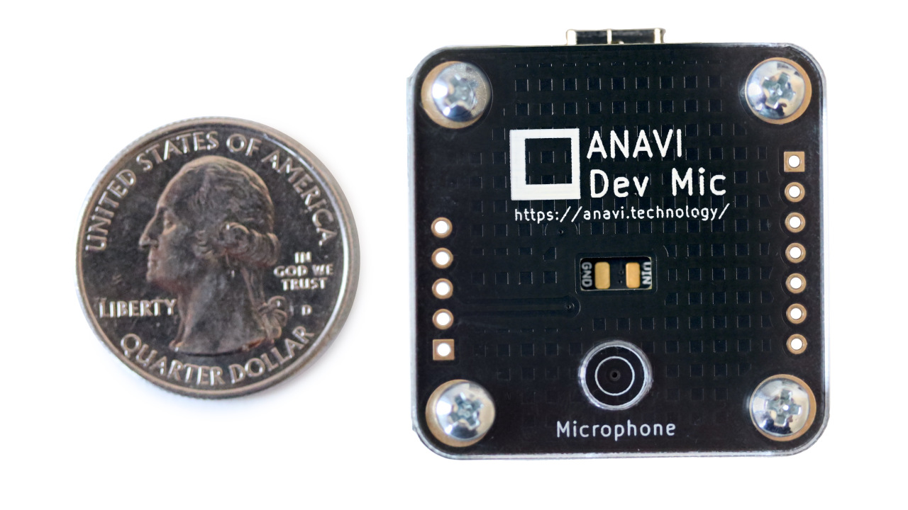
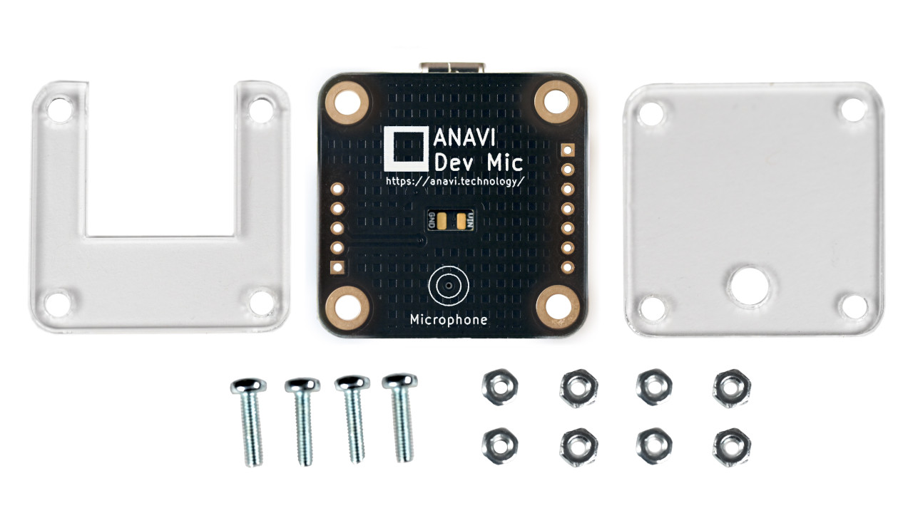
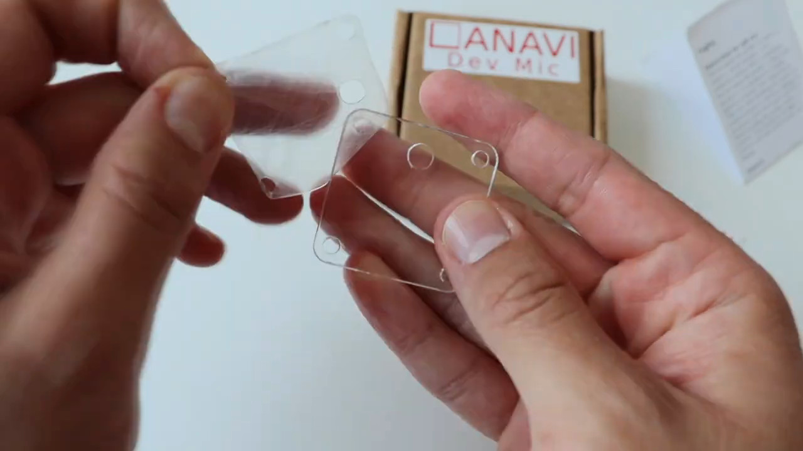
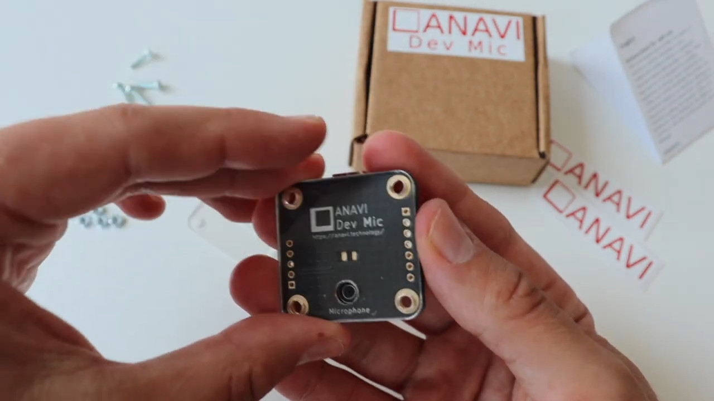
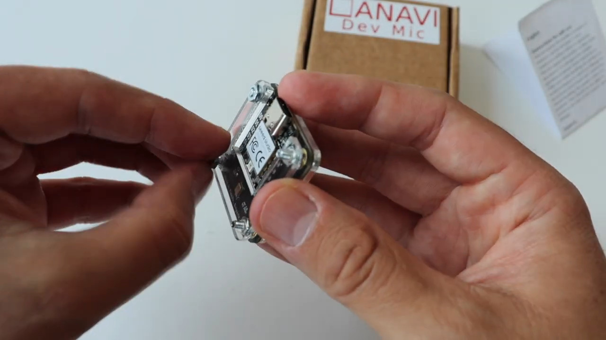

# ANAVI Dev Mic

**Maker friendly open source USB-C computer microphone with AI and ML in mind**



---

# DISCLAIMER

ANAVI, the ANAVI logo and combinations thereof, are registered trademarks of Leon Anavi. Other product names may be trademarks of others and the rights belong to their respective owners.

The information in this document is provided in connection with ANAVI Technology products. No license, express or implied or otherwise, to any intellectual property right is granted by this document or in connection with the sale of Anavi products.

This work is licensed under the Creative Commons Attribution-ShareAlike 3.0 Unported License. To view a copy of this license, visit http://www.creativecommons.org/licenses/by-sa/3.0/.

ANAVI Dev Mic hardware designs are licensed under [Creative Commons Attribution-ShareAlike 4.0 International (CC BY-SA 4.0)](https://creativecommons.org/licenses/by-sa/4.0/).

The software examples are released under MIT and the rest of the software is available under GPLv3.

It is possible that the pictures in this manual differ from the latest revision of the board.

The product described in this document is subject to continuous development and improvements. All particulars of the product and its use contained in this document are given by ANAVI Technology in good faith. However all warranties implied or expressed including but not limited to implied warranties of merchantability or fitness for purpose are excluded. This document is intended only to assist the reader in the use of the product. ANAVI Technology shall not be liable for any loss or damage arising from the use of any information in this document or any error or omission in such information or any incorrect use of the product.

This evaluation board/kit is intended for use for engineering development, demonstration, or evaluation purposes only and is not considered by ANAVI Technology to be a finished end-product fit for general consumer use. People handling the product must have electronics training and observe good engineering practice standards. As such, the goods being provided are not intended to be complete in terms of required design-, marketing-, and/or manufacturing-related protective considerations, including product safety and environmental measures typically found in end products that incorporate such semiconductor components or circuit boards.

There is no warranty for the design materials and the components used to create ANAVI Dev Mic. They are considered suitable only for ANAVI Dev Mic.

---

# CHAPTER 1: Overview

## Introduction

**ANAVI Dev Mic** is a compact, affordable, exceptionally adaptable open-source microphone designed with machine learning in mind. At its core are the Seeed Studio XIAO RP2040 module and an omnidirectional digital microphone that work together to ensure high-quality sound capture and processing.

For artificial intelligence (AI) and machine learning (ML) voice applications, reliable audio capture hinges on the clarity of the microphone. Despite their wide availability, affordable USB microphones can face certain limitations, such as a tendency to pick up excessive environmental noise, inflexible hardware, and proprietary firmware that cannot be updated or improved.

## Features

ANAVI Dev Mic boasts a compact design with a black, gold-plated printed circuit board with the cutting-edge Seeed Studio XIAO RP2040 module. Here are the technical specifications:

- **Module**: [Seeed Studio XIAO RP2040](https://www.seeedstudio.com/XIAO-RP2040-v1-0-p-5026.html)
- **Microcontroller**: Raspberry Pi RP2040
- **Microphone**: [STMicroelectronics MP23DB01HP PDM Micro Electro-Mechanical System (MEMS) omnidirectional digital mic](https://eu.mouser.com/datasheet/2/389/mp23db01hp-1849718.pdf)
- **Connectivity**: USB Type-C
- **Firmware**: Open source based on Raspberry Pi Pico C/C++ SDK
- **Sample Rate**: 16 kHz
- **Compatibility**: Windows, macOS, and Linux support
- **Dimensions**: 35.0 x 34.5 mm (1.38 x 1.36 inches)



## Board Version

Revision 1.0 of ANAVI Dev Mic was used while writing this document. It is possible that it is outdated so it is always recommended to check the latest sources from the GitHub page of the board.

# CHAPTER 2: Getting Started

## Electrostatic Warning

ANAVI Dev Mic is shipped as a do-it-yourself (DIY) kit, with all parts enclosed in protective bags. To prevent damage, ensure the board is **NOT** exposed to high electrostatic potentials. Always wear a grounding strap or a similar protective device when handling the board, and avoid touching the component pins or any other metallic elements.

## Requirements

In order to setup ANAVI Dev Mic the following items are required:

* Personal Computer with MS Windows, Mac OS or GNU/Linux distribution
* USB-C cable

Getting started with ANAVI Dev Mic is easy. Just connected it to the computer. By default the device comes pre-installed with [open source firmware](https://github.com/AnaviTechnology/microphone-library-for-pico/tree/anavi_dev_mic) written in [the C programming language using Raspberry Pi Pico Pico C/C++ SDK](https://datasheets.raspberrypi.org/pico/getting-started-with-pico.pdf).

## Assembly

ANAVI Dev Mic is available as a DIY kit, which includes:

* Printed circuit board
* Two-part acrylic enclosure
* Four 10mm M2.5 screws
* Eight M2.5 nuts



Please follow [the video](https://youtu.be/65bSOuASYaw?si=hii2ADXjtzrV7aNe) and the steps below to assemble the kit.

### Step 1: Peel Off Protective Film



The acrylic enclosures are made from laser-cut parts, each covered with a protective film on both sides. Carefully peel off the film from all surfaces to reveal the crystal-clear acrylic underneath.

### Step 2: Attach Top Acrylic Enclosure



Locate the printed circuit board (PCB) and the top part of the acrylic enclosure, which has a circular opening for the microphone. Align the acrylic enclosure with the white silkscreen circle on the black PCB. Insert a screw into each of the four mounting holes and secure them with the provided nuts.

### Step 3: Install Bottom Acrylic Enclosure



Place the bottom acrylic enclosure over the side of the PCB where the XIAO RP2040 module is located. Fasten the bottom enclosure securely by tightening it with the remaining four nuts.

### Step 4: Connect and Enjoy

Once you have completed these simple steps, your new microphone is ready to use. Just connect ANAVI Dev Mic to your computer using a USB-C cable and you’re all set!

Please note that a USB to USB-C cable is **not** included in any of the kits. Re-use a cable from an old electronic device or purchase a cable according to your taste. Make sure that the cable supports both power and data transfer over USB.

---

# CHAPTER 3: Software

## Open Source Firmware

Out of the box ANAVI Dev Mic comes with [open source firmware](https://github.com/AnaviTechnology/microphone-library-for-pico/tree/anavi_dev_mic) written in [the C programming language using Raspberry Pi Pico Pico C/C++ SDK](https://datasheets.raspberrypi.org/pico/getting-started-with-pico.pdf).
Follow these steps to build the firmware from source and flash it onto your ANAVI Dev Mic:

* Download the Raspberry Pi Pico C/C++ SDK:

```
cd ~
git clone https://github.com/raspberrypi/pico-sdk.git
cd pico-sdk
git submodule update --init
```

* Install Raspberry Pi Pico C/C++ SDK dependencies:

```
sudo apt update
sudo apt install cmake gcc-arm-none-eabi build-essential
```

* Set the PICO_SDK_PATH:

```
export PICO_SDK_PATH=/path/to/pico-sdk
```

* Download the firmware for ANAVI Dev Mic based on "Microphone library for Pico":

```
cd ~
git clone -b anavi_dev_mic https://github.com/AnaviTechnology/microphone-library-for-pico.git
```

* Create the build directory, run CMake, and make:

```
cd microphone-library-for-pico
mkdir build
cd build
cmake .. -DPICO_BOARD=pico
make
```

Follow the steps below to flash the firmware:

* Long press the **BOOT** button (marked **B** on the board).
* While holding the button, connect the Seeed Studio XIAO PR2040 to your computer. A disk drive will appear on your computer.
* Copy `build/examples/anavi_dev_mic/anavi_dev_mic.uf2` file to the ANAVI Dev Mic while it is in BOOT mode.

## Speech-to-Text Recognition

Follow the steps below to do offline speech-to-text recognition using ANAVI Dev Mic in Python3 with [SpeechRecognition library](https://pypi.org/project/SpeechRecognition/) and OpenAI's [Whisper ASR system](https://github.com/openai/whisper) on a Linux computer, for example Raspberry Pi:

* Launch Raspberry Pi OS and open a terminal.
* Create a Python3 virtual environment:
```
python -m venv test
cd test
source bin/activate
```
* Update your system and install necessary dependencies:
```
sudo apt update
sudo apt install portaudio19-dev
```
* Install the required Python libraries:
```
pip install SpeechRecognition pyaudio openai-whisper
```
* Download the source code from GitHub:
```
git clone https://github.com/AnaviTechnology/anavi-examples.git
```
* Run the script:
```
cd anavi-examples/speech-to-text
python3 stt.py
```
* Follow the onscreen instructions to start speaking when the script is listening.

The script is tailored for the ANAVI Dev Mic and will automatically select it from the available microphones. If the ANAVI Dev Mic isn't found, an error will be reported. A [video demonstration](https://youtu.be/XzCWIGtRq4g) featuring the Raspberry Pi 5 running Raspberry Pi OS, which is based on the Debian Linux distribution, is [available on YouTube](https://youtu.be/XzCWIGtRq4g).

---

# CHAPTER 4: Hardware Schematics

The ANAVI Dev Mic is a fully open-source project that integrates open-source hardware with free and open-source software. The [printed circuit board and its acrylic enclosure](https://github.com/AnaviTechnology/anavi-dev-mic) were designed in [KiCad](https://www.kicad.org/), an open-source software suite for electronic design automation (EDA) that runs on Windows, MacOS, and GNU Linux distributions.

## Pinout

ANAVI Dev Mic utilizes the following pins on [Seeed Studio XIAO RP2040](https://wiki.seeedstudio.com/XIAO-RP2040/):

| Component           | Pins                                   |
| ------------------- |:-------------------------------------- |
| MP23DB01HPTR        | D8 (DATA), D10 (CLOCK)                 |

The ANAVI Dev Mic is a maker-friendly microphone designed for customization. It offers extra pins for 5V, 3.3V, GND, and 9 GPIOs (General Purpose Input/Output). You can flash your own firmware to tailor it to specific applications, and expand its functionality by attaching additional components like LED indicators, a mute switch, and other buttons using its GPIO pins.

---

# CHAPTER 5: Frequently Asked Questions (FAQ)

* What is the sample rate of ANAVI Dev Mic?

The sample rate is 16 kHz.

# CHAPTER 6: Revision History

## Document Revision

| Date              | Changes                     | Modified pages  | Author             |
| ----------------- |:---------------------------:| :---------------| :------------------|
| 21 July 2024      | Initial manual release      | All             | Leon Anavi         |
| 27 August 2024    | Add images                  | All             | Leon Anavi         |


## ANAVI Dev Mic

| Revision| Notable changes                                              |
| ------- |:-------------------------------------------------------------|
| 1.0     | Stable version                                               |

## See Also

For more information please visit [anavi.technology](https://anavi.technology/) and our [GitHub repositories](https://github.com/AnaviTechnology). If you have any questions or enquiries please contact us through [Facebook](https://www.facebook.com/AnaviTechnology/), [Twitter](https://twitter.com/AnaviTechnology) or [email](mailto:info@anavi.technology).

---
